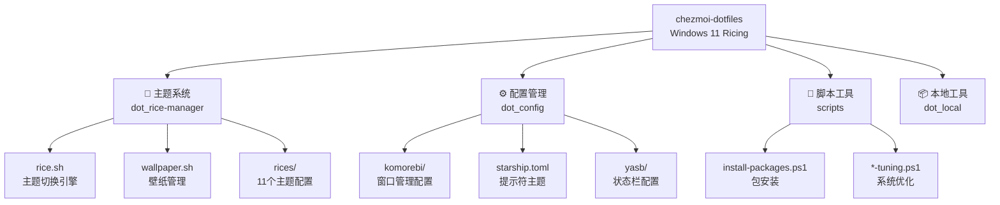

# CLAUDE.md

This file provides guidance to Claude Code (claude.ai/code) when working with code in this repository.

> 📅 Last updated: 2026-01-23

## 概述

Windows 11 桌面美化（ricing）配置仓库，使用 Chezmoi 管理 dotfiles。支持一键切换 11 个精心设计的主题，实现跨应用（终端、窗口管理器、状态栏、VSCode）的统一视觉体验。

**核心工具栈：** Windows Terminal + Zsh (MSYS2) + Komorebi/GlazeWM (平铺窗口管理器) + Yasb/Zebar (状态栏)

## 架构概览



## 目录结构

```
.chezmoiroot               # 指向 .dotfile
.dotfile/                  # Chezmoi 管理的配置模板
├── dot_rice-manager/      # 🎨 主题管理核心 [有本地 CLAUDE.md]
│   ├── rice.sh            # 主题切换脚本
│   ├── wallpaper.sh       # 壁纸切换脚本
│   ├── wackground.ps1     # PowerShell 壁纸设置
│   └── rices/             # 11 个主题配置目录
├── dot_config/            # ⚙️ 应用配置
│   ├── komorebi/          # 窗口管理器配置
│   ├── yasb/              # 状态栏配置
│   └── starship.toml      # 提示符配置
├── dot_local/bin/         # 📦 本地工具（btop, winfetch, colorscript）
└── dot_zshrc              # Zsh 配置
scripts/                   # 🔧 安装/配置脚本 [有本地 CLAUDE.md]
```

## 模块索引

| 模块 | 路径 | 职责 |
|------|------|------|
| [主题系统](.dotfile/dot_rice-manager/CLAUDE.md) | `.dotfile/dot_rice-manager/` | 主题切换引擎、11 个主题配置 |
| [安装脚本](scripts/CLAUDE.md) | `scripts/` | 包安装、系统优化脚本 |

## 主题系统

### 可用主题（11 个）

| 主题 | 配色 | 窗口管理器 | 描述 |
|------|------|------------|------|
| `jade` | 深绿 | GlazeWM | 默认主题，Everforest 风格 |
| `wasabi` | 蓝色 | GlazeWM | Gruvbox Dark |
| `aqua` | 水蓝 | GlazeWM | Ayu Dark |
| `shuri` | 紫色 | GlazeWM | Base16 Tinted |
| `julia` | 暖色 | Komorebi | Horizon Dark |
| `khanhoa` | 浅绿 | Komorebi | Catppuccin Latte (亮色) |
| `khlinh` | 深紫 | Komorebi | Tomorrow Night |
| `meimei` | 棕色 | Komorebi | Gruvbox Hard |
| `mtram` | 森林绿 | Komorebi | Everforest Dark |
| `tlinh` | 彩色 | Komorebi | Monokai Pro |
| `arcade` | 霓虹 | Komorebi | 高对比游戏主题 |

### 主题切换命令

```bash
rice <theme-name>       # 切换完整主题（终端、壁纸、Komorebi、Yasb、VSCode）
wallpaper <theme-name>  # 仅切换壁纸（随机选择）
```

### 主题切换工作流

```
rice <theme-name>
  ↓
1. 加载 rices/{theme}/settings.json
  ↓
2. 更新 Windows Terminal 配置 (colorScheme, font)
  ↓
3. 更新 Komorebi 边框颜色/间距
  ↓
4. 复制 Yasb config.yaml + styles.css
  ↓
5. 合并 VSCode 主题设置
  ↓
6. 随机设置主题壁纸
  ↓
7. 重载服务 (komorebic reload, restart yasb)
```

## 关键路径

| 配置 | 路径 |
|------|------|
| Windows Terminal | `$LOCALAPPDATA/Packages/Microsoft.WindowsTerminal_8wekyb3d8bbwe/LocalState/settings.json` |
| Komorebi | `$USERPROFILE/.config/komorebi/komorebi.json` |
| Yasb | `$USERPROFILE/.config/yasb/{config.yaml,styles.css}` |
| VSCode | `$USERPROFILE/AppData/Roaming/Code/User/settings.json` |
| Rice Manager | `$USERPROFILE/.rice-manager/` |

## Zsh 别名

| 别名 | 功能 |
|------|------|
| `rice` | 主题切换 |
| `wallpaper` | 壁纸切换 |
| `cmsp` | 跳转到 chezmoi 源目录 |
| `update` | 更新 winget + pacman |
| `btop` | 系统监控 |
| `proxy` / `unproxy` | 代理开关 |

## Chezmoi 操作

```bash
chezmoi init --apply jade-tam  # 初始化并应用
chezmoi add <file>             # 添加新配置
chezmoi apply                  # 应用变更到系统
chezmoi diff                   # 查看待应用差异
chezmoi source-path            # 获取源目录路径
```

## 依赖工具

| 工具 | 用途 | 安装方式 |
|------|------|----------|
| Komorebi | 平铺窗口管理器 | winget |
| GlazeWM | 平铺窗口管理器 (备选) | winget |
| Yasb | 状态栏 | winget |
| jq | JSON 配置解析 | winget |
| MSYS2 | Zsh 运行环境 | winget |
| Starship | 终端提示符主题 | winget |

## 开发注意事项

1. **rice.sh 依赖 jq** - 所有配置修改通过 jq 实现，确保路径使用双引号
2. **路径变量** - 使用 `$LOCALAPPDATA`、`$USERPROFILE` 而非硬编码路径
3. **主题配置标准** - 新主题必须包含 `settings.json`、`config.yaml`、`styles.css`、`wallpapers/`
4. **双窗口管理器** - 部分主题使用 GlazeWM，部分使用 Komorebi，注意配置字段差异
