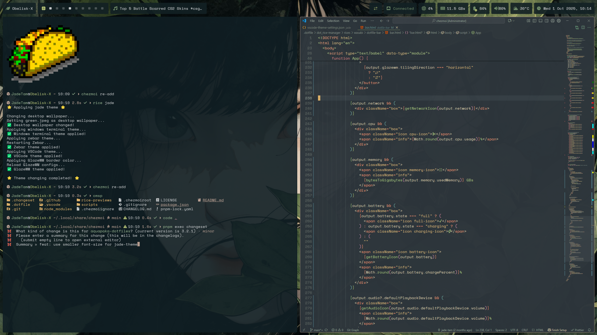

# 🍙 My Ricing Dotfiles for Windows 11

Yes it's **Windows**


## Introduction

### 🐚 Native Shell Scripting — No WSL, No Virtualization

Run real **shell scripts** and **Linux commands** natively on Windows — no WSL, no virtualization, no nonsense. With this setup, you get the full power of Unix-like scripting without sacrificing compatibility.

Why write PowerShell when you can use familiar ```.sh``` scripts? And if you still need PowerShell? You can run both side by side. It's like having the best of both worlds — the flexibility of Linux with the accessibility of Windows.

### ❤️ For the Ricing and Unixporn Enthusiasts

Are you **a ricing nerd** or **a unixporn enthusiast** who has to use Windows but still misses the customizability of Linux? Look no further! This repository is a treasure trove of my ricing dotfiles tailored specifically for Windows.

### ⚙️ Custom Themes and Configurations

It includes a variety of custom themes, scripts, and configurations designed to bring the same level of aesthetic appeal and functionality to your Windows desktop that you love from your Linux setups.

### ⚡ Instant Theme Switching

Easily switch themes on the fly with just one press. Keep your desktop fresh and aligned with your mood or preferences instantly and effortlessly.

### 😍 Transform Your Windows Experience

Dive in, tweak to your heart's content, and transform your Windows environment into a beautifully riced masterpiece!

## Core

- Terminal: **Windows Terminal**
- Shell: **Zsh** inside MSYS2
- Tiling Window Manager: **GlazeWM 3.9.1**
- Bar: **Zebar 3.1.1**
- Package manager: **Winget**
- Dotfiles manager: **Chezmoi**

## 🎨 Themes

ℹ️Note: This dotfiles are configured specifically for my 1440p screen, so things might appear larger on smaller screens. I suggest using my dotfiles as a base and customizing it to fit your specific needs.

| ✨ jade |
| :---: |
| A soul with raw edges, nostalgic warmth, and unspoken strength |
||
||

| ✨ wasabi |
| :---: |
| Mysterious and alluring |
||
||

| ✨ aqua |
| :---: |
| Full of curiosity and charm |
||
||

| ✨ shuri |
| :---: |
| A gentle presence in shades of purple |
||
||
<!--
| 🕹️ arcade |
| :---: |
| ⚠️ WARNING! Only For Truest Gamer!! May hurt your eyes!!! |
||
||

| ✨ khanhoa |
| :---: |
| Joyful and adventurous |
||
||

| ✨ khlinh |
| :---: |
| Gentle and wise, truly exceptional |
||
||

| 💜 shuri |
| :---: |
| Radiant love for purple, deeply cherished soul, mah lovely queen 👑 |
||
|| -->

## ⚙️ Current Configurable Settings

You can customize each theme inside ~/.rice-manager/rices and re-apply it (see **Change theme** below)

- ☑️ Windows Terminal theme
- ☑️ GlazeWM border theme
- ☑️ Zebar theme
- ☑️ Desktop wallpaper based on rice
- ☑️ Vscode theme
- ~~☑️ Windows light/dark mode based on rice~~ ❌ Disabled - currently unstable and buggy
- ❓ Windows color based on rice
- 🚧 *under construction*

## 📑 Basic usage

### Change theme

- From terminal use command: ```rice <theme-name>``` (example: ```rice aqua```)
- Wallpaper is selected randomize from rice's wallpaper folder.
- Use ```rice``` for helps.

### Change wallpaper

- From terminal use command: ```wallpaper <theme-name>``` (example: ```wallpaper aqua```)
- This will change the wallpaper only, allow you to use wallpaper from other themes.
- Wallpaper is selected randomize from selected rice's wallpaper folder.

### Useful keybindings

| Keys | Action |
|:-|:-|
|<kbd>alt</kbd> + <kbd>enter</kbd>| Open terminal|
|<kbd>alt</kbd> + <kbd>Space</kbd>| Open powertoy run |
|<kbd>alt</kbd> + <kbd>h\|j\|k\|l</kbd>| Focus window left \| bottom \| top \| right|
|<kbd>alt</kbd> + <kbd>shift</kbd> + <kbd>h\|j\|k\|l</kbd>| Move focusing window left \| bottom \| top \| right|
|<kbd>alt</kbd> + <kbd>shift</kbd> + <kbd>q</kbd>| Close focusing window|
|<kbd>alt</kbd> + <kbd>1\|2\|3\|4\|5\|6\|7\|8\|9\|0</kbd>| Focus workspace {n}|
|<kbd>alt</kbd> + <kbd>shift</kbd> + <kbd>1\|2\|3\|4\|5\|6\|7\|8\|9\|0</kbd>| Move focusing window to workspace {n}|
|<kbd>alt</kbd> + <kbd>shift</kbd> + <kbd>r</kbd>| Reload glazewm config |
|<kbd>alt</kbd> + <kbd>shift</kbd> + <kbd>e</kbd>| Exit glazewm |

ℹ️ More keybinding can be found [here](https://github.com/glzr-io/glazewm/blob/main/resources/assets/cheatsheet.png)

## 📦 Step by Step Installation (Working 100% - last tested 16/5/2025)

### Pre-install notices

- Those installation steps are not fully verified and you might stuck at any step, if you're having problem, feel free to message me on my discord.
- This dotfiles and it's previews are in 2560x1600 resolution, everything might look bigger on lower resolution.
- Those installation steps won't break your windows, in case things didn't go well, all you need to do are:
  - ```winget uninstall ...``` all packages you have installed through ```install-packages.ps1```
  - Remove added task scheduler tasks
  - Remove added config files in ```~/.config```
- If you have just fresh install windows 11, you need to go to Microsoft Store and update your "App Installer". Otherwise winget will not working.
- For those who use another windows 11 version (like IOT Enterprise LTSC, which doesn't come with Microsoft Store):
  - First download the latest version of winget: <https://aka.ms/getwinget>
  - Then open Powershell and run: ```Add-AppxPackage -Path <path to downloaded .msixbundle>``` to install winget

### Install Fonts

Font need to be download and install manually *(Windows is planning to allows installing fonts from winget. Stay tune!)*:

- [Pixelcraft Nerd Font](https://github.com/jade-tam/Pixelcraft/releases) (please download and use Nerd Font version)
- [Pixel Code](https://qwerasd205.github.io/PixelCode/)
- [Monofur Nerd Font](https://github.com/ryanoasis/nerd-fonts/releases/download/v3.3.0/Monofur.zip)
- [Space Mono Nerd Font](https://github.com/ryanoasis/nerd-fonts/releases/download/v3.4.0/SpaceMono.zip)

### Install chezmoi and apply dotfiles

- Install chezmoi from Winget with: ```winget install chezmoi```
- Close and reopen terminal for chezmoi command to be recognized.
- Initialize chezmoi and apply the dotfiles with: ```chezmoi init --apply jade-tam```
- If you are using Windows Terminal, you will notice the terminal theme changed immediately.

### Install packages

- After chezmoi apply the dotfiles, the chezmoi source folder could be found in ```%userprofile%/.local/share/chezmoi```, ```install-packages.ps1``` file can be found inside ```scripts``` folder (⚠️Note: Windows Terminal is now default open zsh shell which we haven't installed yet so it will show error if you try to open Windows Terminal, let's open Windows Powershell instead)
- Enable allow execute powershell script in windows settings:


- Edit ```install-packages.ps1```, comment out packages/apps that are not needed (All non-required packages are commented by default)
- ⚠️ Note: If glazewm or zebar already installed, please uninstall them first before running the install script, this will make sure the versions are correct.
- Run ```install-packages.ps1``` script with **Powershell** to install nessesary packages (⚠️ Note: sometime installation could fail, re-run the script to ensure all packages has been installed)

### Add New Environment Variables

- Add ```%USERPROFILE%\.local\bin``` to **Path** variable (This is needed for some utilities like btop, colorscript and winfetch to be recognize):
  - 
  - 
  - 
  - 

### Restart

- After everything above are done, restart the PC one time to make sure all new program paths and fonts are registered.

----------------------------

 *🚩 Continue below after MSYS2 has been installed through install-packages.ps1 and you have restarted the pc*

### Change MSYS2 home directory

Edit the "db_home"'s value to "windows" of file /c/msys64/etc/nsswitch.conf (file nsswitch.conf inside C:\msys64\etc)

```
db_home: windows
```

This will set windows user folder as default home directory. Otherwise zsh won't see it config file from user's directory.

### Install Zsh

Open **MSYS2 UCRT64** and run below command to install zsh (Tips: command can be pasted using middle mouse button)

```
# Update pacman
pacman -Syu

# Open MSYS2 Ucrt64 and install ZSH
pacman -S zsh

```

Open **Powershell**, from your user folder (Example: ```C:\Users\JadeTam>```), run below command to install zsh themes and configs

```
# Install Starship Prompt (替代 Powerlevel10k)
# 通过 winget 安装（推荐）
winget install --id Starship.Starship

# 或使用其他方式安装：
# - Chocolatey: choco install starship
# - Scoop: scoop install starship
# - Cargo: cargo install starship --locked

# Install Fast Syntax Highlighting Plugin

git clone https://github.com/zdharma-continuum/fast-syntax-highlighting ./.config/zsh/plugins/fast-syntax-highlighting

# Install Autosuggestions Plugin

git clone https://github.com/zsh-users/zsh-autosuggestions ./.config/zsh/plugins/zsh-autosuggestions

# Install History Substring Search Plugin

git clone https://github.com/zsh-users/zsh-history-substring-search ./.config/zsh/plugins/zsh-history-substring-search
```

**Troubleshoot:** If git is not recognizable, try close and reopen powershell or check whether git is installed through running ```install-packages.ps1``` or not.

### Install VS Code Extensions for Theming

- Icons: [Material Icon Theme](https://marketplace.visualstudio.com/items?itemName=PKief.material-icon-theme) - *best icon pack in my opinion*
- Themes:
  - [Tinted VSCode](https://marketplace.visualstudio.com/items?itemName=TintedTheming.base16-tinted-themes) - *using by other themes*
  - [Gruvbox Theme](https://marketplace.visualstudio.com/items?itemName=jdinhlife.gruvbox) - *using by Wasabi theme*
  - [Everforest](https://marketplace.visualstudio.com/items?itemName=sainnhe.everforest) - *using by Jade theme*
- ADDITIONAL:
  - To change vscode UI Font, use this extension: [Fonted](https://marketplace.visualstudio.com/items?itemName=degreat.fonted)
  - To make VSCode window transparent: <https://marketplace.visualstudio.com/items?itemName=s-nlf-fh.glassit>

### Auto start GlazeWM & Zebar at windows start

- Just need to copy the GlazeWM shortcut.
- Open Start Up folder by pressing **Windows + R** and type in ```shell:startup```
- Paste the shortcut in here and we are done, you can also run GlazeWM now.
- Zebar is open and close with GlazeWM.

### Optional Tweaks

<!---
- Disable windows 11 rounded corners:
  - Install windows 11 rounded corners setup: [win11-toggle-rounded-corners](https://github.com/oberrich/win11-toggle-rounded-corners)
-->
- Enable automatically hide the taskbar (for more vertical space).
- Improve performance and reduce disk utilization for system with high amount of free RAM:
  - Run ```scripts/high-ram-tuning.ps1``` with **Powershell**.
- Restore old context menu (Require restart):
  - Open/Run ```scripts/Restore-old-context-menu.reg```.
<!---
- Fix terminal cursor glitching while typing: (This is only working with Alacritty, current version using Windows Terminal)
  - Run ```scripts/terminal-cursor-fix.sh```
  - Close then re-open terminal
-->
- Show 'Max cpu freq' in power plan setting, allow changing maximum cpu freqency to attempt lower temperature and more stable machine **(Very useful, highly recommend for laptop)**:
  - Run ```scripts/show-cpu-frequency-power-plan-setting.ps1``` with **Powershell**
  - Search for **"Edit Power Plan" > Change Plan Settings > Change advanced power settings > Processor power management > Maximum processor frequency** (Showing after running the script, change this to preferred frequency)

### Other information

- Dotfiles inspired by gh0stzk dotfiles: <https://github.com/gh0stzk/dotfiles>
- Food script by Xero: <https://github.com/xero/dotfiles>
